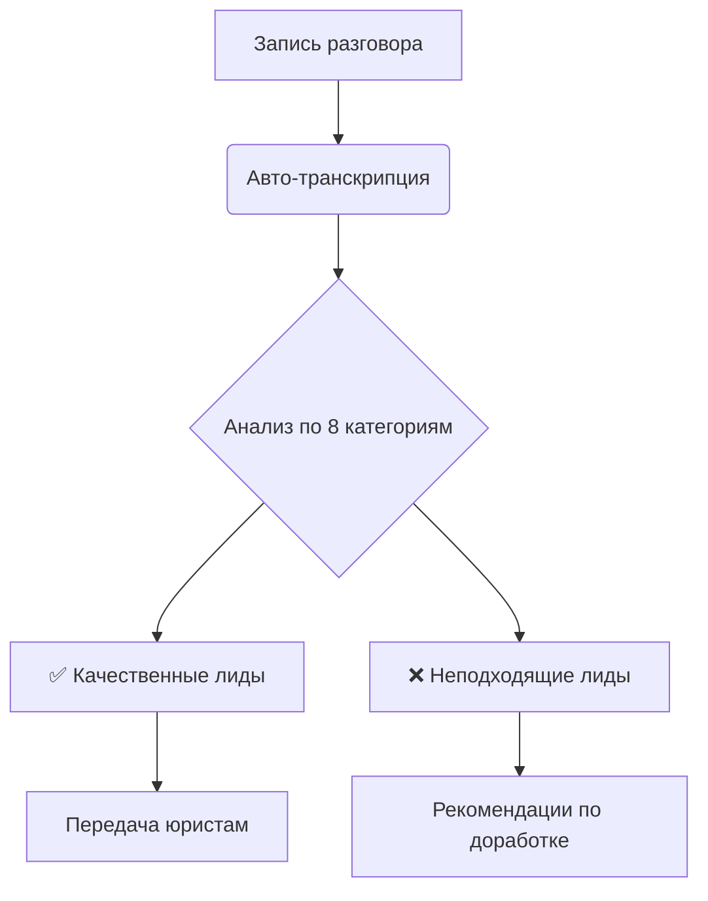

# Neuro_audio


# 🎙️➡️📋 Анализатор разговоров кредитного центра: Автоматическое выявление "брака"

**Превращаем записи разговоров в решения!** Это приложение автоматически анализирует телефонные переговоры кредитного центра, выявляет неподходящие лиды ("брак") и генерирует структурированные отчёты с рекомендациями.

## 🔍 Что умеет этот "цифровой супервайзер"

- **🎧 Расшифровывает записи**: Точное преобразование MP3/WAV в текст с помощью AI
- **🧠 Анализирует по 8 ключевым категориям**: Автоматически определяет "брак" в разговорах
- **🚦 Принимает интеллектуальные решения**: Передавать или не передавать лид? Ответ основан на бизнес-правилах
- **📊 Формирует детальные отчёты**: С обоснованием решения и обнаруженными проблемами
- **💾 Экспортирует результаты**: Скачивайте полную транскрипцию и аналитический отчёт

## 🚀 Как это работает за кулисами

1. **Загружаете запись** разговора (MP3/WAV)
2. **AI расшифровывает** аудио в текст (Whisper API)
3. **Глубинный анализ** по 8 категориям брака (GPT-4)
4. **Мгновенное решение**: Красный/зелёный свет для лида
5. **Детализированный отчёт**: Понимание причин и рекомендаций

## ⚙️ Технологический стек

- **🧠 Искусственный интеллект**: OpenAI Whisper + GPT-4
- **🌐 Веб-интерфейс**: Streamlit
- **🔊 Обработка аудио**: Pydub
- **🔑 Безопасность**: Защищённое хранение ключей API

## 💡 Ключевые преимущества



- **Экономия времени**: Автоматизация рутинной проверки
- **Стандартизация**: Единые критерии для всех операторов
- **Объективность**: Решения без человеческого фактора
- **Аналитика**: Детальные отчёты для улучшения работы

## 🚀 Быстрый старт

1. Установите зависимости:
```bash
pip install openai streamlit pydub python-dotenv
```

2. Запустите приложение:
```bash
streamlit run app.py
```

3. Наслаждайтесь анализом! Приложение откроется по адресу: `http://localhost:8501`

## 🛠️ Как использовать

1. В боковой панели введите ваш OpenAI API ключ
2. Загрузите запись разговора (MP3/WAV)
3. Нажмите "Начать анализ" и наблюдайте за процессом
4. Изучите результаты: решение, причины, рекомендации
5. Скачайте отчёт для архивации или дальнейшего анализа

## 📊 Пример вывода

```json
{
  "decision": "НЕ ПЕРЕДАВАТЬ",
  "reason": "Обнаружена критическая категория 'Ипотека'",
  "detected_categories": [
    {
      "name": "Ипотека",
      "status": "rejected",
      "explanation": "Клиент упомянул: 'У меня ипотечная квартира в залоге'"
    }
  ]
}
```

## 🌟 Для кого это решение

- **Кредитные менеджеры**: Быстрая проверка качества лидов
- **Супервайзеры**: Контроль работы операторов
- **Аналитики**: Выявление системных проблем в продажах
- **Тренеры**: Поиск кейсов для обучения сотрудников

## 📜 Лицензия

MIT License - свободное использование и модификация

---

**Превращаем разговоры в данные, а данные - в решения!** 💼✨


# Чтобы использовать Python 3.9 в проектах, создавайте виртуальные окружения:
```bash
python3.9 -m venv venv
source venv/bin/activate

python3.9 --version


# ## Установка зависимостей
# Выполните эту ячейку для установки необходимых библиотек

pip install openai>=1.0.0 python-dotenv pydub streamlit tqdm pydub

# Для обработки аудио

sudo dnf install -y ffmpeg

# Если проблеммы то
sudo dnf install -y ffmpeg > /dev/null  

# Для Транскрибации аудиофайлов

pip install git+https://github.com/openai/whisper.git 


# Или Проще
pip install -r requirements.txt

# Как запускать

streamlit run app.py

